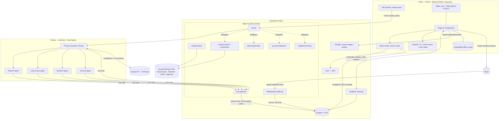

# MoodFood — Technical Architecture & Data Blueprint

**Document:** 02 — Architecture & Data
**Status:** Authoritative (reconciles `orig Docs/moodfood_full_build_spec.md` with `Docs/MOODFOOD_MASTER_PLAN.md`)
**Stack:** React + TypeScript + Tailwind · Supabase (Postgres + Auth + Storage + Edge Functions + Realtime) · MCP tool gateway · Moody (Claude API) · Stripe billing

---

## 0. Reading Notes & Source Reconciliation

Two source specs exist and they diverge in ambition. This blueprint treats the **build spec** (`moodfood_full_build_spec.md`) as the canonical, copy-paste-ready SQL/contract layer (the MVP-shippable core), and the **master plan** (`MOODFOOD_MASTER_PLAN.md`) as the strategic superset that resolves open technical decisions and adds Phase 2/3 surface area.

| Topic | Build spec | Master plan | Decision for this blueprint |
|---|---|---|---|
| Recipe data source | "internal vs provider" left open | Spoonacular primary, BigOven/Edamam/USDA fallback chain via a single Recipe Orchestrator | **Provider-backed with internal cache** (resolved) |
| Nutrition computation | `nutrition_json` blob, "expand later" | Edamam (150+ nutrients) → USDA fallback, longitudinal trends | **Edamam + USDA**, materialized into diary snapshots |
| LLM provider | generic "AI gateway" | Claude API (Anthropic) | **Claude API** |
| State mgmt | React Query | Zustand + React Query | **Zustand (UI/session) + React Query (server cache)** |
| MCP tool count | ~17 tools | ~50 tools (adds pantry, substitution, skill, notifications, video) | **17 = MVP core; full set = roadmap** (both listed in §6) |
| Tables | 22 core | + skill_events, learning_signals, notifications, notification_preferences, ingredient_substitutions, videos, shopping_bag, recipe cache columns | **22 core canonical here; roadmap tables flagged in §2.9** |
| Mobile/voice | "Wake Lock on supported browsers" | Capacitor wrapper for TTS/STT/wake-lock/push | **Web-first PWA, Capacitor for native** |

What already exists in code (`preview site/`): a static landing/marketing site (`index.html`, `app.js`, `styles.css`, `config.js`), and two Stripe edge functions — `create-checkout-session` and `stripe-webhook` — that currently write to a `launch_signups` waitlist table (`supabase/sql/launch_signups.sql`), **not** the production `subscriptions`/`entitlements` tables. The webhook already demonstrates the correct service-role pattern. The production billing webhook in §5 supersedes it.

---

## 1. System Architecture



**Key principles**

- **Moody (the AI) is the decision-making core.** It ingests the user's inputs (`ui_context`: mood, tiredness, time, diet/allergies, pantry, skill, active session) plus their stored profile and personal mood definitions, **decides intent and the right action**, and returns curated recommendations or one clarifying question. This is the product's reason to exist — a mood→meal *decision engine*, not a restaurant-ordering flow or a passive search box. The deterministic engine (`§7`) is the safety-enforcing, candidate-scoring substrate the AI drives; the AI owns the decision, the engine guarantees allergens are never violated and supplies trusted, ranked data.
- The client never calls external APIs or the LLM directly, and never writes billing tables. All AI/tool/external traffic is funneled through Edge Functions.
- Moody is the **primary navigator**: the UI maps `actions[]` returned by `/ai/chat` to buttons; tool execution happens through the MCP gateway, which performs all DB mutations under RLS (or service role for billing).
- Direct CRUD that does not need orchestration (e.g. reading favorites, toggling a grocery checkbox) goes straight to Postgres via PostgREST with the user's JWT — RLS enforces ownership.

---

## 2. Data Model

### 2.1 Table inventory (canonical 22)

| # | Table | Purpose | Key columns | Relationships | RLS |
|---|---|---|---|---|---|
| 1 | `profiles` | 1:1 with auth user; preferences, onboarding, tier | `id`→auth.users, `onboarded`, `subscription_tier`, `preferences_json` | PK=auth.users.id | ✅ own |
| 2 | `assessment_answers` | Onboarding/recalibration answers (autosave) | `user_id`, `question_key`, `answer_json` | →auth.users; unique(user,question) | ✅ own |
| 3 | `mood_definitions` | User's personal meaning per mood | `user_id`, `mood_key`, `definition_json` | unique(user,mood) | ✅ own |
| 4 | `mood_entries` | Mood check-in history | `user_id`, `mood_key`, `tiredness`, `notes` | →auth.users | ✅ own |
| 5 | `recipes` | Recipes (user/imported/provider) | `user_id`(nullable), `source_type`, `total_time_minutes`, `difficulty`, `cuisine`, `tags_json`, `nutrition_json` | →auth.users | ✅ own **+ provider public-read** |
| 6 | `recipe_ingredients` | Structured ingredients | `recipe_id`, `text`, `quantity`, `unit`, `ingredient_key`, `aisle_category` | →recipes (cascade) | ✅ via recipe |
| 7 | `recipe_steps` | Ordered steps + detected timers | `recipe_id`, `step_number`, `text`, `timer_seconds` | →recipes; unique(recipe,step) | ✅ via recipe |
| 8 | `recipe_images` | Storage metadata for images | `recipe_id`, `storage_path`, `caption` | →recipes | ✅ via recipe |
| 9 | `favorites` | Saved recipes | `user_id`, `recipe_id` | unique(user,recipe) | ✅ own |
| 10 | `cooking_sessions` | Live cook-mode state (resume + voice) | `user_id`, `recipe_id`, `current_step`, `ingredient_state_json`, `step_state_json`, `status` | →auth.users, recipes | ✅ own |
| 11 | `diary_entries` | Meal journal | `user_id`, `recipe_id`(nullable), `meal_type`, `mood_key`, `rating`, `notes` | →auth.users, recipes(set null) | ✅ own |
| 12 | `meal_plans` | Plan shell | `user_id`, `title`, `start_date`, `end_date` | →auth.users | ✅ own |
| 13 | `meal_plan_items` | Per-day/meal slot assignment | `meal_plan_id`, `date`, `meal_type`, `recipe_id` | →meal_plans; unique(plan,date,meal) | ✅ via plan |
| 14 | `grocery_lists` | Named lists | `user_id`, `title` | →auth.users | ✅ own |
| 15 | `grocery_items` | Items w/ aisle + checked state | `grocery_list_id`, `text`, `quantity`, `unit`, `aisle_category`, `is_checked` | →grocery_lists | ✅ via list |
| 16 | `pantry_items` | What's at home | `user_id`, `ingredient_key`, `quantity`, `expires_at` | →auth.users | ✅ own |
| 17 | `subscriptions` | Stripe sub mirror | `user_id`, `stripe_customer_id`, `stripe_subscription_id`, `status`, `plan`, `current_period_end` | →auth.users | ✅ select-own, **no client writes** |
| 18 | `entitlements` | Feature gates | `user_id`, `feature_key`, `enabled` | unique(user,feature) | ✅ select-own, **no client writes** |
| 19 | `ai_threads` | Conversation threads | `user_id` | →auth.users | ✅ own |
| 20 | `ai_messages` | Transcript (system/user/assistant/tool) | `thread_id`, `role`, `content`, `metadata_json` | →ai_threads | ✅ via thread |
| 21 | `ai_actions` | Tool-call observability | `thread_id`, `action_key`, `request_json`, `response_json`, `success` | →ai_threads | ✅ via thread |
| 22 | `ai_profile_summaries` | Abstracted shareable food profile | `user_id`, `summary_text`, `share_enabled` | →auth.users | ✅ own |

**Enums:** `subscription_tier` (free/trial/monthly/annual) · `source_type` (user/imported/provider) · `meal_type` (breakfast/lunch/dinner/snack) · `difficulty_level` (easy/medium/hard).

> Note: build spec `meal_type` enum omits `snack`-adjacent values like *afternoon tea* referenced in mood check-in UI; treat extra meal contexts as free-text `mood_entries.notes` / `ui_context`, not enum members, unless the enum is extended.

### 2.2–2.8 Canonical SQL

The schema below is condensed from the build spec but is complete and internally consistent. Every user-owned table enables RLS; `set_updated_at()` trigger maintains `updated_at`.

```sql
-- ===== Extensions & helper =====
create extension if not exists pgcrypto;
create extension if not exists citext;

create or replace function public.set_updated_at()
returns trigger language plpgsql as $$
begin new.updated_at = now(); return new; end; $$;

-- ===== Enums =====
do $$ begin create type public.subscription_tier as enum
  ('free','trial','monthly','annual'); exception when duplicate_object then null; end $$;
do $$ begin create type public.source_type as enum
  ('user','imported','provider'); exception when duplicate_object then null; end $$;
do $$ begin create type public.meal_type as enum
  ('breakfast','lunch','dinner','snack'); exception when duplicate_object then null; end $$;
do $$ begin create type public.difficulty_level as enum
  ('easy','medium','hard'); exception when duplicate_object then null; end $$;

-- ===== profiles =====
create table if not exists public.profiles (
  id uuid primary key references auth.users(id) on delete cascade,
  display_name text,
  avatar_url text,
  onboarded boolean not null default false,
  subscription_tier public.subscription_tier not null default 'free',
  preferences_json jsonb not null default '{}'::jsonb,  -- diet, allergies, cuisines, equipment, skill, thread_id
  created_at timestamptz not null default now(),
  updated_at timestamptz not null default now()
);
create index if not exists profiles_subscription_tier_idx on public.profiles(subscription_tier);
create trigger trg_profiles_updated_at before update on public.profiles
  for each row execute function public.set_updated_at();
alter table public.profiles enable row level security;
create policy "profiles_select_own" on public.profiles for select using (auth.uid() = id);
create policy "profiles_update_own" on public.profiles for update using (auth.uid() = id) with check (auth.uid() = id);
-- (insert handled by auth trigger / service role on signup)

-- ===== assessment_answers =====
create table if not exists public.assessment_answers (
  id uuid primary key default gen_random_uuid(),
  user_id uuid not null references auth.users(id) on delete cascade,
  question_key text not null,
  answer_json jsonb not null,
  created_at timestamptz not null default now()
);
create index if not exists assessment_answers_user_idx on public.assessment_answers(user_id);
create unique index if not exists assessment_answers_user_question_uniq
  on public.assessment_answers(user_id, question_key);
alter table public.assessment_answers enable row level security;
create policy "assessment_select_own" on public.assessment_answers for select using (auth.uid() = user_id);
create policy "assessment_insert_own" on public.assessment_answers for insert with check (auth.uid() = user_id);
create policy "assessment_update_own" on public.assessment_answers for update using (auth.uid() = user_id) with check (auth.uid() = user_id);

-- ===== mood_definitions =====
create table if not exists public.mood_definitions (
  id uuid primary key default gen_random_uuid(),
  user_id uuid not null references auth.users(id) on delete cascade,
  mood_key text not null,
  definition_json jsonb not null default '{}'::jsonb,  -- wants[], avoids[], effort_ceiling, cuisine_boosts, max_cook_time
  created_at timestamptz not null default now(),
  updated_at timestamptz not null default now()
);
create unique index if not exists mood_definitions_user_mood_uniq on public.mood_definitions(user_id, mood_key);
create trigger trg_mood_definitions_updated_at before update on public.mood_definitions
  for each row execute function public.set_updated_at();
alter table public.mood_definitions enable row level security;
create policy "mood_def_select_own" on public.mood_definitions for select using (auth.uid() = user_id);
create policy "mood_def_insert_own" on public.mood_definitions for insert with check (auth.uid() = user_id);
create policy "mood_def_update_own" on public.mood_definitions for update using (auth.uid() = user_id) with check (auth.uid() = user_id);

-- ===== mood_entries =====
create table if not exists public.mood_entries (
  id uuid primary key default gen_random_uuid(),
  user_id uuid not null references auth.users(id) on delete cascade,
  mood_key text not null,
  tiredness int not null default 0 check (tiredness between 0 and 100),
  notes text,
  created_at timestamptz not null default now()
);
create index if not exists mood_entries_user_created_idx on public.mood_entries(user_id, created_at desc);
alter table public.mood_entries enable row level security;
create policy "mood_entries_select_own" on public.mood_entries for select using (auth.uid() = user_id);
create policy "mood_entries_insert_own" on public.mood_entries for insert with check (auth.uid() = user_id);

-- ===== recipes (own + provider public-read) =====
create table if not exists public.recipes (
  id uuid primary key default gen_random_uuid(),
  user_id uuid references auth.users(id) on delete cascade,  -- null for provider/global recipes
  title text not null,
  description text,
  source_type public.source_type not null default 'user',
  source_url text,
  prep_time_minutes int,
  cook_time_minutes int,
  total_time_minutes int,
  servings int,
  difficulty public.difficulty_level,
  cuisine text,
  tags_json jsonb not null default '{}'::jsonb,        -- mood_tags, diet flags, equipment, effort_score, skill_band
  nutrition_json jsonb not null default '{}'::jsonb,   -- per-serving macros/micros from Edamam/USDA
  created_at timestamptz not null default now(),
  updated_at timestamptz not null default now()
);
create index if not exists recipes_user_idx on public.recipes(user_id);
create index if not exists recipes_time_idx on public.recipes(total_time_minutes);
create index if not exists recipes_cuisine_idx on public.recipes(cuisine);
create index if not exists recipes_tags_gin_idx on public.recipes using gin(tags_json);
-- GAP-FIX (recommended): full-text search for keyword search on Search page
create index if not exists recipes_title_trgm_idx on public.recipes using gin (title gin_trgm_ops); -- needs pg_trgm
create trigger trg_recipes_updated_at before update on public.recipes
  for each row execute function public.set_updated_at();
alter table public.recipes enable row level security;
create policy "recipes_select_own_or_provider" on public.recipes for select
  using ((auth.uid() = user_id) or (source_type = 'provider' and user_id is null));
create policy "recipes_insert_own" on public.recipes for insert with check (auth.uid() = user_id);
create policy "recipes_update_own" on public.recipes for update using (auth.uid() = user_id) with check (auth.uid() = user_id);
create policy "recipes_delete_own" on public.recipes for delete using (auth.uid() = user_id);

-- ===== recipe_ingredients / recipe_steps / recipe_images =====
-- (each: SELECT allowed if parent recipe is owned OR provider; ALL writes only if parent owned)
create table if not exists public.recipe_ingredients (
  id uuid primary key default gen_random_uuid(),
  recipe_id uuid not null references public.recipes(id) on delete cascade,
  text text not null, quantity numeric, unit text,
  ingredient_key text, aisle_category text,
  created_at timestamptz not null default now()
);
create index if not exists recipe_ingredients_recipe_idx on public.recipe_ingredients(recipe_id);
create index if not exists recipe_ingredients_ingredient_key_idx on public.recipe_ingredients(ingredient_key);
alter table public.recipe_ingredients enable row level security;
create policy "ri_select_allowed" on public.recipe_ingredients for select using (
  exists (select 1 from public.recipes r where r.id = recipe_id
    and (r.user_id = auth.uid() or (r.source_type='provider' and r.user_id is null))));
create policy "ri_write_own" on public.recipe_ingredients for all
  using (exists (select 1 from public.recipes r where r.id = recipe_id and r.user_id = auth.uid()))
  with check (exists (select 1 from public.recipes r where r.id = recipe_id and r.user_id = auth.uid()));

create table if not exists public.recipe_steps (
  id uuid primary key default gen_random_uuid(),
  recipe_id uuid not null references public.recipes(id) on delete cascade,
  step_number int not null, text text not null, timer_seconds int,
  created_at timestamptz not null default now()
);
create unique index if not exists recipe_steps_recipe_step_uniq on public.recipe_steps(recipe_id, step_number);
alter table public.recipe_steps enable row level security;
create policy "rs_select_allowed" on public.recipe_steps for select using (
  exists (select 1 from public.recipes r where r.id = recipe_id
    and (r.user_id = auth.uid() or (r.source_type='provider' and r.user_id is null))));
create policy "rs_write_own" on public.recipe_steps for all
  using (exists (select 1 from public.recipes r where r.id = recipe_id and r.user_id = auth.uid()))
  with check (exists (select 1 from public.recipes r where r.id = recipe_id and r.user_id = auth.uid()));

create table if not exists public.recipe_images (
  id uuid primary key default gen_random_uuid(),
  recipe_id uuid not null references public.recipes(id) on delete cascade,
  storage_path text not null, caption text,
  created_at timestamptz not null default now()
);
create index if not exists recipe_images_recipe_idx on public.recipe_images(recipe_id);
alter table public.recipe_images enable row level security;
create policy "rimg_select_allowed" on public.recipe_images for select using (
  exists (select 1 from public.recipes r where r.id = recipe_id
    and (r.user_id = auth.uid() or (r.source_type='provider' and r.user_id is null))));
create policy "rimg_write_own" on public.recipe_images for all
  using (exists (select 1 from public.recipes r where r.id = recipe_id and r.user_id = auth.uid()))
  with check (exists (select 1 from public.recipes r where r.id = recipe_id and r.user_id = auth.uid()));

-- ===== favorites =====
create table if not exists public.favorites (
  id uuid primary key default gen_random_uuid(),
  user_id uuid not null references auth.users(id) on delete cascade,
  recipe_id uuid not null references public.recipes(id) on delete cascade,
  created_at timestamptz not null default now()
);
create unique index if not exists favorites_user_recipe_uniq on public.favorites(user_id, recipe_id);
alter table public.favorites enable row level security;
create policy "fav_select_own" on public.favorites for select using (auth.uid() = user_id);
create policy "fav_insert_own" on public.favorites for insert with check (auth.uid() = user_id);
create policy "fav_delete_own" on public.favorites for delete using (auth.uid() = user_id);

-- ===== cooking_sessions =====
create table if not exists public.cooking_sessions (
  id uuid primary key default gen_random_uuid(),
  user_id uuid not null references auth.users(id) on delete cascade,
  recipe_id uuid not null references public.recipes(id) on delete cascade,
  current_step int not null default 1,
  ingredient_state_json jsonb not null default '{}'::jsonb,
  step_state_json jsonb not null default '{}'::jsonb,  -- completed steps, timers, voice: voice_mode_enabled/last_spoken_step/is_listening/is_speaking
  status text not null default 'active' check (status in ('active','paused','completed','abandoned')),
  created_at timestamptz not null default now(),
  updated_at timestamptz not null default now()
);
create index if not exists cooking_sessions_user_status_idx on public.cooking_sessions(user_id, status);
create index if not exists cooking_sessions_user_created_idx on public.cooking_sessions(user_id, created_at desc);
create trigger trg_cooking_sessions_updated_at before update on public.cooking_sessions
  for each row execute function public.set_updated_at();
alter table public.cooking_sessions enable row level security;
create policy "cs_select_own" on public.cooking_sessions for select using (auth.uid() = user_id);
create policy "cs_write_own" on public.cooking_sessions for all using (auth.uid() = user_id) with check (auth.uid() = user_id);

-- ===== diary_entries =====
create table if not exists public.diary_entries (
  id uuid primary key default gen_random_uuid(),
  user_id uuid not null references auth.users(id) on delete cascade,
  recipe_id uuid references public.recipes(id) on delete set null,
  meal_type public.meal_type not null,
  servings int, mood_key text,
  rating int check (rating between 1 and 5),
  notes text,
  -- GAP-FIX (recommended): persist nutrition snapshot so Insights aggregates don't re-query providers
  nutrition_json jsonb not null default '{}'::jsonb,
  created_at timestamptz not null default now()
);
create index if not exists diary_entries_user_created_idx on public.diary_entries(user_id, created_at desc);
create index if not exists diary_entries_user_meal_idx on public.diary_entries(user_id, meal_type);
alter table public.diary_entries enable row level security;
create policy "diary_select_own" on public.diary_entries for select using (auth.uid() = user_id);
create policy "diary_write_own" on public.diary_entries for all using (auth.uid() = user_id) with check (auth.uid() = user_id);

-- ===== meal_plans / meal_plan_items =====
create table if not exists public.meal_plans (
  id uuid primary key default gen_random_uuid(),
  user_id uuid not null references auth.users(id) on delete cascade,
  title text not null default 'Meal Plan',
  start_date date not null, end_date date not null,
  created_at timestamptz not null default now()
);
create index if not exists meal_plans_user_date_idx on public.meal_plans(user_id, start_date, end_date);
alter table public.meal_plans enable row level security;
create policy "mp_select_own" on public.meal_plans for select using (auth.uid() = user_id);
create policy "mp_write_own" on public.meal_plans for all using (auth.uid() = user_id) with check (auth.uid() = user_id);

create table if not exists public.meal_plan_items (
  id uuid primary key default gen_random_uuid(),
  meal_plan_id uuid not null references public.meal_plans(id) on delete cascade,
  date date not null,
  meal_type public.meal_type not null,
  recipe_id uuid references public.recipes(id) on delete set null,
  servings int, notes text
);
create unique index if not exists meal_plan_items_uniq on public.meal_plan_items(meal_plan_id, date, meal_type);
alter table public.meal_plan_items enable row level security;
create policy "mpi_select_own" on public.meal_plan_items for select using (
  exists (select 1 from public.meal_plans mp where mp.id = meal_plan_id and mp.user_id = auth.uid()));
create policy "mpi_write_own" on public.meal_plan_items for all
  using (exists (select 1 from public.meal_plans mp where mp.id = meal_plan_id and mp.user_id = auth.uid()))
  with check (exists (select 1 from public.meal_plans mp where mp.id = meal_plan_id and mp.user_id = auth.uid()));

-- ===== grocery_lists / grocery_items =====
create table if not exists public.grocery_lists (
  id uuid primary key default gen_random_uuid(),
  user_id uuid not null references auth.users(id) on delete cascade,
  title text not null default 'Grocery List',
  created_at timestamptz not null default now(),
  updated_at timestamptz not null default now()
);
create trigger trg_grocery_lists_updated_at before update on public.grocery_lists
  for each row execute function public.set_updated_at();
alter table public.grocery_lists enable row level security;
create policy "gl_select_own" on public.grocery_lists for select using (auth.uid() = user_id);
create policy "gl_write_own" on public.grocery_lists for all using (auth.uid() = user_id) with check (auth.uid() = user_id);

create table if not exists public.grocery_items (
  id uuid primary key default gen_random_uuid(),
  grocery_list_id uuid not null references public.grocery_lists(id) on delete cascade,
  text text not null, quantity numeric, unit text,
  aisle_category text, is_checked boolean not null default false,
  created_at timestamptz not null default now()
);
create index if not exists grocery_items_list_idx on public.grocery_items(grocery_list_id);
create index if not exists grocery_items_checked_idx on public.grocery_items(grocery_list_id, is_checked);
alter table public.grocery_items enable row level security;
create policy "gi_select_own" on public.grocery_items for select using (
  exists (select 1 from public.grocery_lists gl where gl.id = grocery_list_id and gl.user_id = auth.uid()));
create policy "gi_write_own" on public.grocery_items for all
  using (exists (select 1 from public.grocery_lists gl where gl.id = grocery_list_id and gl.user_id = auth.uid()))
  with check (exists (select 1 from public.grocery_lists gl where gl.id = grocery_list_id and gl.user_id = auth.uid()));

-- ===== pantry_items =====
create table if not exists public.pantry_items (
  id uuid primary key default gen_random_uuid(),
  user_id uuid not null references auth.users(id) on delete cascade,
  ingredient_key text not null, quantity numeric, unit text, expires_at date,
  created_at timestamptz not null default now()
);
create index if not exists pantry_user_idx on public.pantry_items(user_id);
alter table public.pantry_items enable row level security;
create policy "pantry_select_own" on public.pantry_items for select using (auth.uid() = user_id);
create policy "pantry_write_own" on public.pantry_items for all using (auth.uid() = user_id) with check (auth.uid() = user_id);

-- ===== subscriptions / entitlements (webhook-written via service role only) =====
create table if not exists public.subscriptions (
  id uuid primary key default gen_random_uuid(),
  user_id uuid not null references auth.users(id) on delete cascade,
  stripe_customer_id text, stripe_subscription_id text,
  status text, plan public.subscription_tier not null default 'free',
  current_period_end timestamptz,
  created_at timestamptz not null default now(),
  updated_at timestamptz not null default now()
);
create index if not exists subscriptions_user_idx on public.subscriptions(user_id);
create index if not exists subscriptions_stripe_customer_idx on public.subscriptions(stripe_customer_id);
create trigger trg_subscriptions_updated_at before update on public.subscriptions
  for each row execute function public.set_updated_at();
alter table public.subscriptions enable row level security;
create policy "sub_select_own" on public.subscriptions for select using (auth.uid() = user_id);
create policy "sub_no_client_writes" on public.subscriptions for all using (false) with check (false);

create table if not exists public.entitlements (
  id uuid primary key default gen_random_uuid(),
  user_id uuid not null references auth.users(id) on delete cascade,
  feature_key text not null, enabled boolean not null default true,
  created_at timestamptz not null default now()
);
create unique index if not exists entitlements_user_feature_uniq on public.entitlements(user_id, feature_key);
alter table public.entitlements enable row level security;
create policy "ent_select_own" on public.entitlements for select using (auth.uid() = user_id);
create policy "ent_no_client_writes" on public.entitlements for all using (false) with check (false);

-- ===== AI observability: ai_threads / ai_messages / ai_actions / ai_profile_summaries =====
create table if not exists public.ai_threads (
  id uuid primary key default gen_random_uuid(),
  user_id uuid not null references auth.users(id) on delete cascade,
  created_at timestamptz not null default now()
);
create index if not exists ai_threads_user_idx on public.ai_threads(user_id);
alter table public.ai_threads enable row level security;
create policy "ait_select_own" on public.ai_threads for select using (auth.uid() = user_id);
create policy "ait_insert_own" on public.ai_threads for insert with check (auth.uid() = user_id);

create table if not exists public.ai_messages (
  id uuid primary key default gen_random_uuid(),
  thread_id uuid not null references public.ai_threads(id) on delete cascade,
  role text not null check (role in ('system','user','assistant','tool')),
  content text not null, metadata_json jsonb not null default '{}'::jsonb,
  created_at timestamptz not null default now()
);
create index if not exists ai_messages_thread_idx on public.ai_messages(thread_id, created_at);
alter table public.ai_messages enable row level security;
create policy "aim_select_own" on public.ai_messages for select using (
  exists (select 1 from public.ai_threads t where t.id = thread_id and t.user_id = auth.uid()));
create policy "aim_insert_own" on public.ai_messages for insert with check (
  exists (select 1 from public.ai_threads t where t.id = thread_id and t.user_id = auth.uid()));

create table if not exists public.ai_actions (
  id uuid primary key default gen_random_uuid(),
  thread_id uuid not null references public.ai_threads(id) on delete cascade,
  action_key text not null,
  request_json jsonb not null default '{}'::jsonb,
  response_json jsonb not null default '{}'::jsonb,
  success boolean not null default true,
  created_at timestamptz not null default now()
);
create index if not exists ai_actions_thread_idx on public.ai_actions(thread_id, created_at desc);
alter table public.ai_actions enable row level security;
create policy "aia_select_own" on public.ai_actions for select using (
  exists (select 1 from public.ai_threads t where t.id = thread_id and t.user_id = auth.uid()));
create policy "aia_insert_own" on public.ai_actions for insert with check (
  exists (select 1 from public.ai_threads t where t.id = thread_id and t.user_id = auth.uid()));

create table if not exists public.ai_profile_summaries (
  id uuid primary key default gen_random_uuid(),
  user_id uuid not null references auth.users(id) on delete cascade,
  summary_text text not null,
  share_enabled boolean not null default false,
  created_at timestamptz not null default now(),
  updated_at timestamptz not null default now()
);
create trigger trg_ai_profile_summaries_updated_at before update on public.ai_profile_summaries
  for each row execute function public.set_updated_at();
alter table public.ai_profile_summaries enable row level security;
create policy "aps_select_own" on public.ai_profile_summaries for select using (auth.uid() = user_id);
create policy "aps_write_own" on public.ai_profile_summaries for all using (auth.uid() = user_id) with check (auth.uid() = user_id);
```

### 2.9 Flagged gaps & roadmap tables

**Gaps in the canonical 22 (fix before/at MVP):**
- **No `profiles` INSERT policy.** A row must be created on signup — add a `handle_new_user()` trigger on `auth.users` (security definer) or insert via service role. Without it, a fresh user has no profile row.
- **No nutrition detail tables.** Nutrition lives only in `recipes.nutrition_json`. For the Insights engine to aggregate without re-hitting Edamam, persist a per-serving snapshot on `diary_entries.nutrition_json` (added above) — or introduce a `nutrition_facts` table keyed by `recipe_id`/`diary_entry_id` if you need queryable micronutrient columns.
- **Keyword search.** Search page supports keyword input but there's no FTS index. Added `pg_trgm` index on `recipes.title` above; consider a `tsvector` column over title+description+tags for richer search.
- **Recipe-images bucket policy not codified as SQL.** The metadata table has RLS but the Storage bucket policy must mirror it (see §4) — easy to forget.
- **Provider recipe writes.** Provider recipes (`user_id` null) cannot be inserted under any current policy — they must be written by the orchestrator via **service role** (the orchestrator bypasses RLS). Document this explicitly so nobody tries a client insert.
- **Recipe caching columns.** Master plan's 3-tier cache implies `recipes` needs `cache_expires_at`, `external_id`, `external_source` columns to dedupe and expire provider data. Recommend adding these.

**Roadmap tables (master plan, Phase 2/3 — out of canonical core, listed for completeness):**
`skill_events`, `learning_signals`, `ingredient_substitutions`, `videos`/`saved_videos`, `shopping_bag` (or a `bag` flag on grocery), `notifications`, `notification_preferences`. These back the Skill Progression, learning loop, allergen substitution, video library, and notification systems.

---

## 3. RLS Strategy

Single consistent pattern across the schema:

1. **Ownership via `auth.uid()`.** Every user-owned table filters `auth.uid() = user_id` (or `= id` for `profiles`). Child tables (ingredients, steps, images, grocery items, plan items, ai_messages/actions) gate on an `EXISTS` against the parent's ownership — no denormalized `user_id` needed.
2. **Provider recipes are public-read.** `recipes` and its children additionally allow SELECT when `source_type='provider' AND user_id IS NULL`. Writes to provider rows are never allowed via RLS — only the orchestrator's **service-role** client may insert/update them.
3. **Billing tables are read-only to clients.** `subscriptions` and `entitlements` expose SELECT-own only; an explicit `USING (false) WITH CHECK (false)` policy blocks all client writes. The Stripe webhook writes them with the **service role key**, which bypasses RLS.
4. **MCP/Edge writes.** The MCP gateway executes tools either (a) with the caller's JWT (RLS-enforced, preferred for user-owned mutations) or (b) with service role for cross-cutting operations (provider recipe upserts, entitlement sync). Default to JWT; reserve service role for the narrow set that genuinely needs it.

**Anything missing / to add:**
- `profiles` INSERT (signup trigger) — see §2.9.
- A `WITH CHECK` on every `FOR ALL` policy is present; verify the `FOR INSERT`-only policies (favorites, mood_entries, assessment) also cover UPDATE/DELETE where the UI needs them (favorites delete is covered; mood_entries are append-only by design — acceptable).
- Consider a `service_role`-only RLS bypass audit: ensure no Edge Function leaks the service role key to the client bundle (the existing `stripe-webhook` correctly reads it from `Deno.env`).

---

## 4. Storage Buckets

| Bucket | Access | Path pattern | Policy approach |
|---|---|---|---|
| `recipe-images` | **Private** | `{user_id}/{recipe_id}/{filename}` | Authenticated read/write only where the leading path segment equals `auth.uid()`. Owned-recipe images served via **signed URLs** (short TTL). Provider recipe images are referenced by external CDN URL in `recipe_images.storage_path` (or copied in by the orchestrator via service role) — no per-user policy needed. |
| `avatars` | Public (or private + signed) | `{user_id}/avatar.{ext}` | Public-read for simplicity (avatars are low-sensitivity); write restricted to `auth.uid()` path prefix. If privacy-strict, keep private + signed URLs. |
| `recipe-ocr-uploads` (roadmap) | Private, temp | `{user_id}/scan_{ts}.jpg` | Write-own; auto-expire via lifecycle / scheduled cleanup. |

Storage RLS uses the standard `storage.objects` policy form:
```sql
create policy "recipe_images_rw_own" on storage.objects for all to authenticated
  using (bucket_id = 'recipe-images' and (storage.foldername(name))[1] = auth.uid()::text)
  with check (bucket_id = 'recipe-images' and (storage.foldername(name))[1] = auth.uid()::text);
```
This bucket policy must be created alongside the schema — it is the most commonly forgotten piece (flagged in §2.9).

---

## 5. Edge Functions / Agentic API

Base: `https://<project-ref>.functions.supabase.co`. User calls carry `Authorization: Bearer <supabase_jwt>`. Service role key is used **only inside** functions, never shipped to the client.

| Endpoint | Method | Purpose | Auth | Notes |
|---|---|---|---|---|
| `/ai/chat` (`ai-chat`) | POST | Primary Moody gateway. In: `{thread_id, user_message, ui_context}`. Out: `{thread_id, assistant_message, actions[], follow_up_question?, quick_replies?}`. | JWT required | Calls Claude with the tool schema; routes to sub-agents; persists to `ai_threads/messages/actions`. Must always return actionable output (see §6 rules). |
| `/mcp` (`mcp-gateway`) | POST | Single tool router for assistant + agents. Validates tool name/args, enforces entitlement + ownership, executes DB/Edge ops, logs `ai_actions`. | JWT required (service role internally where needed) | The **only** path for AI-initiated mutations. No direct client DB writes from the AI layer. |
| `/recipes/search` (`recipes-search` / orchestrator) | POST | Ranked, mood-weighted search; enforces hard filters; queries cache then Spoonacular→BigOven→Edamam fallback; normalizes + caches. | JWT required | Backs `searchRecipes`. Provider rows written via service role. |
| `/recipes/import` (`recipe-import`) | POST | `{url}` → `{title, times, servings, ingredients[], steps[], images[]}`. Fetch HTML → JSON-LD recipe → fallback parser → Claude structuring. | JWT required | Backs `importRecipeFromUrl`. |
| `/grocery/categorize` (`grocery-categorize`) | POST | `{grocery_list_id}` → aisle-sort + combine duplicates. Out: `{updated, combined_count}`. | JWT required; list must belong to caller | Backs `categorizeAndCombineGroceryList`. |
| `/planner/generate` (`mealplan-generate`) | POST | `{start_date, days, constraints}` → creates `meal_plans` + `meal_plan_items`. Deterministic + constrained. | JWT required | Planner Agent. Gated (premium). |
| `/insights/summary` (`insights-summary`) | POST | `{window_days}` → `{variety_score, top_repeats[], suggestions[]}`. | JWT required | Nutrition Agent; reads `diary_entries`. |
| `/billing/stripe-webhook` (`stripe-webhook`) | POST | Receive Stripe events → update `subscriptions` + `entitlements`. | **No JWT** — Stripe signature verification (`constructEventAsync`) required | Writes via **service role** (client has no write policy). Existing implementation in `preview site/` shows the pattern but targets `launch_signups`; production version must map `customer`/`subscription` events to the user and set `subscription_tier`/entitlements. |
| `create-checkout-session` | POST | Create Stripe Checkout session for trial→monthly or annual (no lifetime). | JWT required | Already present in `preview site/supabase/functions/`. |

Roadmap functions (master plan): `recipe-social-import`, `recipe-ocr-import`, `video-metadata`, `nutrition-analyze`, `grocery-generate`, `pantry-recipe-compare`, `ingredient-substitute`, `pantry-staleness-check`, `notification-scheduler`, `notification-dispatch`.

---

## 6. AI / MCP Orchestration

### 6.1 Topology

- **Primary assistant (Moody)** is the decision-maker, router, and navigator. It receives `ui_context` (route, mood, tiredness, time limit, diet/allergies, active session) **plus the user's profile and personal mood definitions**, and from those inputs **decides what the user needs** — which recipes fit *this* person in *this* state, whether to cook/plan/shop, and how to coach — then either responds with concrete `actions[]` or asks exactly one clarifying question. It either acts on the decision itself or delegates to a sub-agent. Decisions are personalised (a user's "comfort" or "stressed" means what *they* defined it to mean), never generic.
- **Sub-agents:** **Planner** (meal plans + constraints + variety), **Cook Coach** (cook-mode steps, timers, voice state machine, substitutions), **Nutrition** (insights, deficits, gentle nudges), **Grocery** (aisle grouping, merge, budget swaps). Master plan adds Substitution, Import, and Profile agents.
- All agents call tools **only through the MCP gateway** (`/mcp`). No agent writes the DB directly from the client. The LLM provider is **Claude (Anthropic)**.

### 6.2 MCP tool schema — MVP core (17, build spec)

`getProfile` · `updateProfile` · `logMood` · `getMoodDefinitions` · `updateMoodDefinitions` · `searchRecipes` · `getRecipe` · `toggleFavorite` · `startCookingSession` · `setCurrentStep` · `checkOffIngredient` · `startTimer` · `finishCookingSession` · `createGroceryListFromRecipes` · `categorizeAndCombineGroceryList` · `createMealPlan` · `setMealPlanItem` · `importRecipeFromUrl` · `getInsightsSummary`

(Note: that build-spec list is the canonical "~17"; it actually enumerates 19 once `createMealPlan`/`setMealPlanItem`/`importRecipeFromUrl` are counted. Treat all of the above as the MVP set.)

Each tool maps 1:1 to a DB operation or Edge Function. Purposes:
- **Profile/mood:** read/patch UIM (`getProfile`/`updateProfile`); record check-ins (`logMood`); read/write personalized mood→food meaning (`get/updateMoodDefinitions`). Allergen/diet patches require explicit user confirmation.
- **Discovery:** `searchRecipes` (hard-filter + scored), `getRecipe` (full detail), `toggleFavorite`.
- **Cook mode:** `startCookingSession`, `setCurrentStep`, `checkOffIngredient`, `startTimer`, `finishCookingSession` (auto-creates diary entry).
- **Grocery/plan:** `createGroceryListFromRecipes`, `categorizeAndCombineGroceryList`, `createMealPlan`, `setMealPlanItem`.
- **Import/insight:** `importRecipeFromUrl`, `getInsightsSummary`.

### 6.3 MCP tool schema — full roadmap (~50, master plan)

Adds: video (`getVideoLibrary`, `saveVideo`, `importVideoMetadata`), OCR import (`importRecipeFromOcr`), planner (`generateMealPlan`), diary (`logDiaryEntry`), pantry & shopping bag (`comparePantryToRecipe`, `getShoppingBag`, `add/removeFromShoppingBag`, `convertBagToGroceryList`, `updatePantryFromSession`, `getPantryStatus`, `getPantryFreshness`, `updatePantryBulk`, `verifyPantryItem`), skill (`getSkillProfile`, `logSkillSignal`), nutrition/learning (`getNutritionTrends`, `getMoodPatterns`, `updateLearningSignal`), substitution (`getAllergenSubstitutions`, `applySubstitution`, `checkSubstitutionAvailability`, `saveRecipeVariant`, `logSubstitutionSignal`), and notifications (`getNotifications`, `markNotificationRead`, `dismissNotification`, `get/updateNotificationPreference`).

### 6.4 Non-negotiable AI behavior rules

1. **Never violate allergies/dietary restrictions** — hard constraints, enforced both in the prompt and in `searchRecipes` server-side filters.
2. **Never invent recipes or nutrition facts** — only use tool/DB-returned data.
3. **If missing required constraints, ask exactly ONE question** with 3–6 quick-reply chips.
4. **Every response is either** (A) a recommendation + 1–3 actions, **or** (B) one clarifying question + quick options. No dead-end chatter.
5. **Supportive, non-judgmental tone; no medical advice.**
6. **Respect time/skill limits; prefer 3–7 results.**
7. **Explain "why" briefly** (1–2 sentences) and never expose internal IDs in user-facing text (IDs go in tool args only).
8. **Tool discipline:** to show recipes, call `searchRecipes` first; for save/add/plan/grocery, call the specific tool — don't describe how. Confirm irreversible actions (delete, public share).

Output contract: JSON `{ assistant_message, actions:[{label,tool,args}], follow_up_question?, quick_replies? }`.

### 6.5 Observability tables

`ai_threads` (one per conversation) → `ai_messages` (system/user/assistant/tool transcript) → `ai_actions` (every tool invocation with request/response/success). These give full replay + debugging and are RLS-scoped to the owning user. `thread_id` persisted per user (in `profiles.preferences_json.thread_id` or localStorage).

---

## 7. Recommendation Engine

**Where it runs:** authoritative ranking in the `recipes-search` Edge Function (so allergen/diet enforcement and provider calls are server-trusted). The client carries only a lightweight **hint** layer (`lib/recommendation.ts`) for instant re-sorts of already-fetched results (e.g. "make it spicier" reorders client-side before the next server call).

**Stage 1 — Hard filters (absolute exclusion, in order):**
1. Allergen exclusions — life-threatening (🔴) allergens exclude the recipe entirely, before scoring; intolerant (🟡) excluded from the main set; "prefer to avoid" (🟠) soft-penalised (see Stage 2). **MVP = exclude/penalise only.** *Roadmap:* once the `ingredient_substitutions` system (§2.9) exists, 🟡 recipes with a verified swap for every offending ingredient surface in an "Adaptable for you" section, and 🟠 recipes get an `Adaptable` badge (`DESIGN_SYSTEM §7.26–7.27`).
2. Dietary requirements (recipe `diets[]` must satisfy).
3. Equipment subset check.
4. Effort budget ceiling (from tiredness score).
5. Time constraint (`total_time_minutes ≤ limit`).
6. Skill ceiling (≤ current band +1, +1 only for the single "Skill Push" slot).

**Stage 2 — Soft scoring (weighted blend):**
```
score = mood_match×0.30 + cuisine_pref×0.15 + variety_bonus×0.15
      + effort_comfort×0.10 + skill_fit×0.10 + nutrition_signal×0.10
      + pantry_match×0.05 − recency_penalty×0.05
```

**Variety / repetition detection:** repeat counts per ingredient/cuisine/meal over 7–14 days from `diary_entries`; variety bonus (never seen=1.0, >30d=0.7, <7d=0.2) and recency penalty (cooked ≤7d=−1.0, 8–14d=−0.5). Surfaces "New for you" / "You cook this often" / "Great variety" badges.

**Nutrition deficit-aware boosting:** if a deficit flag is active (e.g. low fibre over 7+ days), `nutrition_signal` boosts addressing recipes by up to +0.10 — a soft nudge, never a hard filter, and surfaces a "Supports your goals" badge plus micro-fix suggestions ("add a side salad").

---

## 8. Cross-Cutting Concerns

- **Realtime sync targets:** Supabase Realtime channels on `grocery_items`/`grocery_lists` (multi-device shopping) and `cooking_sessions` (phone↔tablet↔desktop handoff). Subscriptions are RLS-scoped, so users only receive their own row changes.
- **Wake Lock:** `navigator.wakeLock` acquired when a cook session is `active`, released on pause/finish/visibility loss; reacquired on `visibilitychange`. Capacitor plugin fallback on native.
- **Voice (TTS/STT) state machine:** `idle → speaking(step_n) → listening → action → speaking(step_n+1)`. Commands: start/next/repeat/pause/resume/previous/skip + "how much longer"/"next ingredient". Persisted in `cooking_sessions.step_state_json` (`voice_mode_enabled`, `last_spoken_step_index`, `is_listening`, `is_speaking`) so it survives refresh and syncs across devices. Web Speech API on web; Capacitor bridge for native/background audio.
- **Offline / session recovery:** cook session state is persisted server-side every step, so a refresh resumes exactly. IndexedDB caches last ~50 viewed recipes, full favourites, current plan, active session, and grocery lists; Realtime reconciles on reconnect.
- **Entitlement gating:** `entitlements` (server truth, webhook-written) + client `lib/entitlements.ts` for UI gating. Gated features: AI meal-plan generation, web/social import, advanced insights/variety score, unlimited saves (free-tier cap). Server functions re-check entitlements — never trust the client gate alone.
- **Privacy:** mood data is sensitive → default private, sharing opt-in. The shareable **psychological food profile** (`ai_profile_summaries`) is **abstracted** (cuisines, tempo, comfort foods, mood→food tendencies) — never raw diary entries. Data export + account/diary deletion supported (compliance).
- **"Informational, not medical" guardrail:** all nutrition insights are labelled informational, never medical advice; language is supportive/non-shaming ("try", "consider", "you might like"). Enforced in the Nutrition Agent prompt and Insights UI copy.

---

## 9. Key Technical Decisions & Open Questions

**Resolved (by master plan, adopted here):**
- **Recipe source:** provider-backed — **Spoonacular** primary, **BigOven** fallback for niche cuisines, all via a single server-side Recipe Orchestrator; results cached into `recipes` (7-day TTL). Internal user/imported recipes coexist via `source_type`.
- **Nutrition:** **Edamam** (150+ nutrients, NLP parsing) → **USDA FoodData Central** fallback → estimated. Snapshot persisted on diary entries for trend aggregation.
- **LLM provider:** **Claude API (Anthropic)** for Moody.
- **Web vs native:** **web-first PWA**, wrapped with **Capacitor** for iOS/Android to get reliable background TTS/STT, wake-lock, and push (APNs/FCM). Electron desktop is Phase 3/optional.

**Open questions / decisions to confirm:**
1. **MCP hosting.** Is `/mcp` a true MCP server process (separate Deno/Node service) or an Edge Function emulating the MCP contract? Build spec implies an Edge endpoint; master plan calls it an MCP gateway. Recommend: start as an Edge Function speaking the MCP tool contract; promote to a standalone MCP server only if multiple external clients need it.
2. **JWT vs service role inside `/mcp`.** Default to per-call JWT (RLS-enforced) and enumerate the exact tools that require service role (provider upserts, entitlement sync). Needs a written allow-list.
3. **Provider API cost & quota at scale.** Spoonacular Growth ($99/mo) + Edamam ($49/mo) set a unit-economics floor; caching aggressiveness and the free-tier search cap need product sign-off.
4. **Recipe licensing/attribution.** Storing normalized provider recipes in `recipes` may have ToS/attribution constraints — confirm before persisting full ingredient/step text vs. linking out.
5. **Search infra.** `pg_trgm`/`tsvector` is adequate for MVP keyword search; revisit if semantic/embedding search (pgvector) is wanted for "find me something like X".
6. **Nutrition detail modeling.** JSON snapshot (chosen) vs. a normalized `nutrition_facts` table — decide based on whether Insights needs per-micronutrient SQL aggregation.
7. **Stripe ↔ user mapping.** Production webhook must reliably resolve Stripe `customer`/`subscription` → `auth.users.id` (store `stripe_customer_id` at checkout). The current `preview site` webhook writes a waitlist table and must be reworked.
8. **`profiles` provisioning.** Confirm the signup trigger (`handle_new_user`) approach vs. service-role insert — required for the app to function at all.
```
